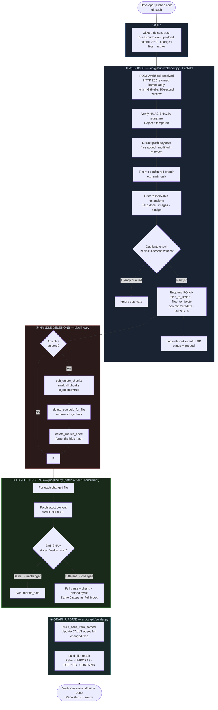
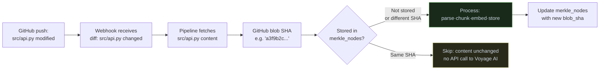

# Codebase Indexing & Re-Indexing Flow

> **Who this is for:** This document is written for both technical and non-technical readers.
> Plain-language explanations are given first; technical details follow in expandable sections.

---

## What Is Indexing?

When you add a GitHub repository to NexusCode, the system reads every source file,
understands the code structure (functions, classes, imports), converts it into a
searchable form, and stores it in a database.  This process is called **indexing**.

Later, whenever a developer pushes code changes, only the changed files are
re-processed and the database is updated. This is called **re-indexing** (or
incremental indexing).

The end result: any question about the codebase — "where is this function called?",
"what files import this module?", "how does feature X work?" — can be answered in
milliseconds without ever re-reading GitHub.

---

## Two Ways Indexing Is Triggered

| Trigger | When | Who starts it |
|---------|------|---------------|
| **Full Index** | First time a repo is added, or a forced refresh | Developer via API (`POST /repos/{owner}/{name}/index`) or CLI (`scripts/full_index.py`) |
| **Incremental Index** | Every time code is pushed to the repo | GitHub automatically via Webhook → NexusCode |

---

## High-Level Picture

```
┌─────────────────────────────────────────────────────────────────┐
│                        TRIGGER LAYER                            │
│                                                                 │
│   GitHub Push ──→ Webhook  ──┐                                  │
│   POST /repos/index ─────────┼──→  Redis Job Queue             │
│   CLI full_index.py ─────────┘         │                        │
└────────────────────────────────────────┼────────────────────────┘
                                         │
                                         ▼
┌─────────────────────────────────────────────────────────────────┐
│                       PIPELINE (RQ Worker)                      │
│                                                                 │
│   1. FETCH      GitHub API → raw file content                   │
│   2. DETECT     Has this file changed? (Merkle / blob SHA)      │
│   3. PARSE      Tree-sitter → symbols, imports, calls           │
│   4. CHUNK      Split into ~512-token pieces                    │
│   5. SUMMARIZE  LLM (Claude) → one-paragraph file summary       │
│   6. ENRICH     Add context headers to each chunk               │
│   7. EMBED      Voyage AI → 1536-dimension vector per chunk     │
│   8. STORE      PostgreSQL + pgvector                           │
│   9. GRAPH      Build knowledge-graph edges                     │
└─────────────────────────────────────────────────────────────────┘
                                         │
                                         ▼
┌─────────────────────────────────────────────────────────────────┐
│                        DATABASE (PostgreSQL)                    │
│                                                                 │
│   chunks      — searchable code pieces with embeddings          │
│   symbols     — every function / class / method                 │
│   merkle_nodes — change-detection fingerprints per file         │
│   kg_edges    — knowledge-graph relationships                   │
└─────────────────────────────────────────────────────────────────┘
```

---

## Full Indexing Flow

```mermaid
flowchart TD
    A([Developer registers repo\nor triggers manual index]) --> B

    subgraph TRIGGER ["① TRIGGER — src/api/repos.py · scripts/full_index.py"]
        B[Register repo in DB\nstatus = 'indexing'] --> C
        C[Fetch full file tree\nvia GitHub Git Trees API] --> D
        D[Filter to indexable extensions\n.py .ts .tsx .js .java .go .rs etc.] --> E
        E[Fetch HEAD commit metadata\nSHA · author · message] --> F
        F[Enqueue single RQ job\nfiles_to_upsert = all files\ntimeout = 1 hour]
    end

    F --> G

    subgraph PIPELINE ["② PIPELINE — src/pipeline/pipeline.py  •  RQ Worker"]
        G[Split files into batches of 50\nmax 5 concurrent GitHub API calls] --> H

        subgraph PERFILE ["For each file in batch"]
            H[Fetch file content\nfrom GitHub REST API] --> I
            I{Blob SHA matches\nstored Merkle hash?}
            I -- Yes → skip --> J[Mark as merkle_skip\nno work needed]
            I -- No → changed --> K

            subgraph PARSE ["③ PARSE — src/pipeline/parser.py · tree-sitter"]
                K[Detect language by extension] --> L
                L[Tree-sitter AST parse\nExtract symbols, imports, call graph]
                L --> L1[ParsedSymbol per function/class/method\nname · kind · signature · docstring · calls]
            end

            L1 --> M

            subgraph CHUNK ["④ CHUNK — src/pipeline/chunker.py · tiktoken"]
                M[Recursive AST-aware split\nTarget 512 tokens · Min 50 · Overlap 128] --> N
                N[Greedy merge pass\ncombine adjacent small chunks]
            end

            N --> O

            subgraph SUMMARIZE ["⑤ SUMMARIZE — src/pipeline/summarizer.py · Claude LLM"]
                O[Send file content to Claude\nTruncated to 20K chars] --> P
                P[Receive one-paragraph summary\nInserted as chunk at position 0]
            end

            P --> Q

            subgraph ENRICH ["⑥ ENRICH — src/pipeline/enricher.py"]
                Q[Prepend context header to each chunk:\nfile path · language · scope chain · key imports] --> R
                R[Compute SHA-256 chunk_id\nLink method chunks to parent class chunks]
            end
        end

        R --> S

        subgraph EMBED ["⑦ EMBED — src/pipeline/embedder.py · Voyage AI"]
            S[Check which chunk IDs already\nhave embeddings in DB → cache hits] --> T
            T[Batch remaining chunks\nup to 128 per request · 120K token limit] --> U
            U[Call voyage-code-2 model\nReturns 1536-dim float vector per chunk] --> V
            V[Exponential backoff on rate limits\nRetry up to 3 times]
        end

        V --> W

        subgraph STORE ["⑧ STORE — src/storage/db.py · SQLAlchemy · PostgreSQL"]
            W[Upsert new chunks\nON CONFLICT DO UPDATE\nRestores soft-deleted chunks] --> X
            X[Restore cache-hit chunks\nclear is_deleted flag] --> Y
            Y[Soft-delete stale chunks\nis_deleted = true for old chunk IDs] --> Z
            Z[Hard-delete old symbols\nthen upsert fresh symbols] --> AA
            AA[Update Merkle hash\nstore new blob_sha for change detection]
        end

        AA --> AB

        subgraph GRAPH ["⑨ GRAPH — src/graph/builder.py"]
            AB[build_calls_from_parsed\nWrite CALLS edges from AST call data] --> AC
            AC[build_file_graph\nIMPORTS · DEFINES · CONTAINS edges]
        end
    end

    AC --> AD([Repo status = 'ready'\nAll files searchable])

    style TRIGGER fill:#1a2332,stroke:#3d6a9e,color:#cdd9e5
    style PIPELINE fill:#1a2a1a,stroke:#3d8a3d,color:#cdd9e5
    style PERFILE fill:#0d1117,stroke:#2d4a2d,color:#cdd9e5
    style PARSE fill:#1a1a2e,stroke:#4a4a8a,color:#cdd9e5
    style CHUNK fill:#1a1a2e,stroke:#4a4a8a,color:#cdd9e5
    style SUMMARIZE fill:#2a1a2a,stroke:#8a4a8a,color:#cdd9e5
    style ENRICH fill:#2a1a1a,stroke:#8a4a4a,color:#cdd9e5
    style EMBED fill:#2a2a1a,stroke:#8a8a4a,color:#cdd9e5
    style STORE fill:#1a2a2a,stroke:#3d8a8a,color:#cdd9e5
    style GRAPH fill:#1a2a2a,stroke:#3d8a8a,color:#cdd9e5
```



---

## Incremental Re-Indexing Flow (Webhook Push)

This is the automatic path triggered every time a developer runs `git push`.



---

## Step-by-Step Explanation

### ① Trigger

**Plain English:** Something kicks off the indexing. Either a developer presses a button / runs a command, or GitHub automatically tells NexusCode "hey, code just changed."

**Two paths:**

| | Full Index | Incremental |
|--|-----------|------------|
| Source file | `src/api/repos.py` · `scripts/full_index.py` | `src/github/webhook.py` |
| Who calls it | Human (API/CLI) | GitHub (webhook HTTP POST) |
| Scope | Every file in the repo | Only files in the commit diff |
| RQ job timeout | 1 hour | 10 minutes |

**Technical detail:**
Both paths create the same job payload and enqueue it on the `indexing` queue in **Redis** using the **RQ** (Redis Queue) library. A separate long-running process — the *RQ worker* — picks up jobs and processes them. This decoupling means the webhook can respond to GitHub in under 1 second while the actual work happens in the background.

```
Webhook receives push → logs to DB → enqueues RQ job → returns HTTP 202
                                           ↓
                                    RQ Worker picks it up (async)
```

---

### ② Fetch

**Plain English:** NexusCode downloads the raw source code of each file from GitHub. It never clones the repository to disk — it calls GitHub's REST API file by file.

**Source file:** `src/github/fetcher.py`
**Library:** `httpx` (async HTTP client)

**How it works:**
- Calls `GET /repos/{owner}/{name}/contents/{path}?ref={commit_sha}`
- GitHub returns the file as **base64-encoded** content
- NexusCode decodes it to a UTF-8 string
- If the file is binary or not valid UTF-8, it is silently skipped
- Rate limits are respected: exponential backoff waits using `X-RateLimit-Reset` header
- At most **5 files are fetched concurrently** (asyncio Semaphore) to avoid bursting the rate limit

---

### ③ Change Detection (Merkle Nodes)

**Plain English:** GitHub assigns each file a unique fingerprint (called a blob SHA) that changes whenever the file's content changes. NexusCode stores the last-seen fingerprint for every file. If the fingerprint hasn't changed since last time, the file is skipped — saving time and API costs.

**Source file:** `src/storage/db.py` → `get_merkle_hash()` / `upsert_merkle_node()`
**Table:** `merkle_nodes`

```
┌─────────────────────────────────────────────────────┐
│  merkle_nodes table                                 │
│                                                     │
│  file_path  │  repo_owner  │  repo_name  │ blob_sha │
│  ───────────┼──────────────┼─────────────┼──────────│
│  src/api.py │  acme-corp   │  my-app     │  a3f9... │
└─────────────────────────────────────────────────────┘

  GitHub blob SHA  ==  stored blob SHA  →  SKIP (unchanged)
  GitHub blob SHA  !=  stored blob SHA  →  PROCESS (changed)
```

This check is called a **Merkle check** (inspired by Merkle trees used in version control).

---

### ④ Parse

**Plain English:** NexusCode reads the structure of each source file — not just the text, but the actual meaning. It identifies every function, class, and method, extracts their signatures and docstrings, and notes what other functions each one calls.

**Source file:** `src/pipeline/parser.py`
**Library:** `tree-sitter` + language grammars (`tree-sitter-python`, `tree-sitter-typescript`, `tree-sitter-java`, `tree-sitter-go`, `tree-sitter-rust`)

**Supported languages:** Python · TypeScript · TSX · JavaScript · Java · Go · Rust

**What is extracted per symbol:**

| Field | Example |
|-------|---------|
| `name` | `handle_payment` |
| `qualified_name` | `PaymentService.handle_payment` |
| `kind` | `method` |
| `signature` | `async def handle_payment(amount: Decimal) -> bool` |
| `docstring` | `"Process a payment transaction..."` |
| `calls` | `["validate_card", "charge_stripe", "log_event"]` |
| `start_line` / `end_line` | `142` / `178` |

**How tree-sitter works:**
Tree-sitter builds a concrete syntax tree (CST) in milliseconds without running the code. It handles partial/broken code gracefully. Each grammar is a compiled `.so` shared library loaded at startup.

---

### ⑤ Chunk

**Plain English:** Each file is broken into small, self-contained pieces called *chunks*. Each chunk is about the size of a function or class body. This is necessary because AI models can only process a limited amount of text at once — we can't embed an entire file as one unit.

**Source file:** `src/pipeline/chunker.py`
**Library:** `tiktoken` (OpenAI's token counter, used to measure chunk size)

**Algorithm — "recursive split-then-merge":**

```
File
 └─ Class A                        ← symbol boundary
     ├─ method_1  (200 tokens)     ← chunk 1
     ├─ method_2  (180 tokens)     ← chunk 2 (merge → 380 tokens, under 512 ✓)
     └─ method_3  (300 tokens)     ← chunk 3 (can't merge, would exceed 512)
 └─ function_b   (100 tokens)     ← chunk 4
 └─ function_c    (60 tokens)     ← chunk 5 (merge with 4 → 160 tokens ✓)
```

**Parameters:**

| Setting | Value | Why |
|---------|-------|-----|
| Target size | 512 tokens | Fits in the Voyage AI embedding context window |
| Overlap | 128 tokens | Adjacent chunks share context so searches don't miss cross-boundary concepts |
| Minimum | 50 tokens | Avoid creating tiny useless chunks |

**Fallback:** Files with no recognized symbols (e.g. plain text, configs) are split using a simple sliding window.

---

### ⑥ Summarize

**Plain English:** Claude (Anthropic's AI) reads the full file and writes a one-paragraph English summary of what the file does. This summary is stored as a special chunk so that natural-language searches like *"where is authentication handled?"* can match at the file level, not just the function level.

**Source file:** `src/pipeline/summarizer.py`
**Library:** `anthropic` SDK via `src/llm/` provider abstraction
**Model:** Configured LLM (defaults to Claude)

- File content is truncated to 20 000 characters before sending to the LLM
- The summary is inserted as **chunk position 0** in the chunk list
- If no API key is configured or the feature is disabled, this step is silently skipped
- The summary chunk has `symbol_kind = "file_summary"` so it can be filtered separately

---

### ⑦ Enrich

**Plain English:** Before converting a chunk to a vector, NexusCode adds a short "header" to it explaining where the code lives and what it belongs to. This extra context makes the vector more meaningful — the AI knows the code is "a method in class PaymentService in file src/payments/service.py using the stripe library."

**Source file:** `src/pipeline/enricher.py`

**Example of an enriched chunk:**
```
# File: src/payments/service.py
# Language: python
# Scope: PaymentService > handle_payment
# Imports: stripe, decimal, logging

async def handle_payment(amount: Decimal) -> bool:
    """Process a payment transaction."""
    charge = await stripe.Charge.create(amount=amount)
    ...
```

**Also computed here:**
- `chunk_id` — a **SHA-256 hash** of the enriched content. If content hasn't changed, the ID is the same → embedding can be reused
- `parent_chunk_id` — method chunks are linked to their parent class chunk (for hierarchical retrieval)

---

### ⑧ Embed

**Plain English:** Each enriched chunk is converted into a list of 1 536 numbers (called a *vector* or *embedding*). Similar code produces similar vectors. This is what powers semantic search — "find code related to payment processing" matches functions that handle payments even if they don't contain the exact words.

**Source file:** `src/pipeline/embedder.py`
**Library / Service:** `voyageai` SDK → `voyage-code-2` model (by Voyage AI)
**Vector dimensions:** 1 536

**Smart caching:**
```
Before sending to Voyage AI:
  - Compute chunk_id (SHA-256 of enriched content)
  - Check which IDs already exist in the DB
  - Skip those → reuse stored vectors (cache hits)
  - Only call the API for genuinely new/changed chunks
```

**Batching:**

| Limit | Value |
|-------|-------|
| Max chunks per API call | 128 |
| Max tokens per API call | 120 000 (or 8 000 on free tier) |
| Retry on rate limit | 3 times, exponential backoff |

---

### ⑨ Store

**Plain English:** The chunks (with their vectors) and all the symbol information are saved into the database. Old versions of changed files are marked as deleted rather than physically removed, so the data can be recovered if needed.

**Source file:** `src/storage/db.py`
**Library:** `SQLAlchemy` (async ORM) + `asyncpg` (PostgreSQL driver) + `pgvector` extension

**Three tables written:**

```
┌──────────────────────────────────────────────────────────────────┐
│  chunks table                                                    │
│  id (SHA-256) · file_path · repo · language · symbol info       │
│  raw_content · enriched_content · embedding vector(1536)        │
│  is_deleted · commit metadata                                   │
├──────────────────────────────────────────────────────────────────┤
│  symbols table                                                   │
│  qualified_name · kind · file_path · signature · docstring      │
│  start_line · end_line · is_exported                            │
├──────────────────────────────────────────────────────────────────┤
│  merkle_nodes table                                              │
│  file_path · repo · blob_sha · last_indexed                     │
└──────────────────────────────────────────────────────────────────┘
```

**Soft-delete + restore pattern (avoids data loss):**

```
Step 1: Upsert new chunks            ← new data is in DB
Step 2: Restore cache-hit chunks     ← unchanged chunks re-activated
Step 3: Soft-delete stale chunks     ← only OLD chunks removed
         (is_deleted = true)

If anything fails at Step 1 → Steps 2 and 3 never run → old data survives
```

---

### ⑩ Build Knowledge Graph

**Plain English:** After storing everything, NexusCode draws a map of how the codebase is connected: which files import which other files, which classes contain which methods, and which functions call each other. This map powers the visual Knowledge Graph in the dashboard and improves search quality.

**Source file:** `src/graph/builder.py`
**Table:** `kg_edges`

**Four edge types:**

```
imports  : file ────────→ file      (derived from chunks.imports[])
           "auth.py imports db.py"

defines  : file ────────→ symbol    (from symbols table)
           "service.py defines PaymentService.handle_payment"

contains : class ───────→ method    (from qualified_name dots)
           "PaymentService contains handle_payment"

calls    : symbol ──────→ symbol    (from AST-extracted calls)
           "handle_payment calls charge_stripe"
```

---

## Change Detection Deep Dive

This is the key mechanism that makes re-indexing fast.



**Why blob SHA, not file mtime?**
GitHub's blob SHA is computed from the file content (like a checksum), not from when it was last modified. This means the check is 100% reliable — if two files have the same SHA, they have identical content, period.

---

## Data Flow Summary (Technical)

```
GitHub REST API
    │  base64 file content
    ▼
fetcher.py  ──────────────────────────────────────────────  httpx
    │  (content: str, blob_sha: str)
    ▼
merkle check  (db.py get_merkle_hash) ─ SKIP if unchanged ─  asyncpg
    │  changed files only
    ▼
parser.py  ────────────────────────────────────────────────  tree-sitter
    │  ParsedFile(symbols: list[ParsedSymbol], imports: list[str])
    ▼
chunker.py  ───────────────────────────────────────────────  tiktoken
    │  list[RawChunk]
    ▼
summarizer.py  ────────────────────────────────────────────  anthropic SDK
    │  + summary RawChunk at index 0
    ▼
enricher.py  ──────────────────────────────────────────────  hashlib (SHA-256)
    │  list[EnrichedChunk]  (enriched_content, chunk_id, parent_chunk_id)
    ▼
embedder.py  ──────────────────────────────────────────────  voyageai SDK
    │  dict[chunk_id → vector(1536)]
    ▼
db.py  ─────────────────────────────────────────────────────  SQLAlchemy + pgvector
    │  chunks table · symbols table · merkle_nodes table
    ▼
builder.py  ────────────────────────────────────────────────  SQLAlchemy
    │  kg_edges table
    ▼
 ✅  Ready for search
```

---

## Library Reference

| Library | Role | Where used |
|---------|------|-----------|
| `fastapi` | HTTP API server — exposes `/repos`, `/webhook` endpoints | `src/api/` · `src/github/webhook.py` |
| `httpx` | Async HTTP client — fetches files from GitHub REST API | `src/github/fetcher.py` |
| `redis` + `rq` | Job queue — decouples webhook from long-running pipeline | `src/github/webhook.py` · `src/pipeline/pipeline.py` |
| `tree-sitter` | AST parsing — extracts symbols, imports, call graph from source code | `src/pipeline/parser.py` |
| `tiktoken` | Token counting — measures chunk size in LLM tokens (not characters) | `src/pipeline/chunker.py` |
| `anthropic` SDK | LLM calls — generates per-file plain-English summaries | `src/pipeline/summarizer.py` |
| `voyageai` SDK | Code embedding — converts text to 1536-dim semantic vectors | `src/pipeline/embedder.py` |
| `sqlalchemy` | Async ORM — all DB reads/writes (chunks, symbols, merkle, edges) | `src/storage/db.py` |
| `asyncpg` | PostgreSQL async driver — underlies SQLAlchemy | `src/storage/db.py` |
| `pgvector` | PostgreSQL extension — stores and queries float vectors with HNSW index | `src/storage/migrations/` |
| `structlog` | Structured JSON logging — pipeline progress, errors, metrics | Throughout pipeline |

---

## Frequently Asked Questions

**Q: What happens if the Voyage AI API is down during indexing?**
A: The embedder retries 3 times with exponential backoff. If all retries fail, that batch of files is counted as an error but the pipeline continues with other files. The repo status is set to `error` only if *every* file fails.

**Q: What happens if I push 1 000 files at once?**
A: The pipeline splits them into batches of 50 and processes each batch sequentially. Within each batch, up to 5 files are fetched from GitHub simultaneously. The RQ job timeout is 1 hour, which is enough for very large repos.

**Q: Can the same file be indexed twice at the same time?**
A: No. The webhook has a 60-second Redis deduplication window — if the same file appears in two pushes within 60 seconds, only one job is enqueued.

**Q: What does "soft-delete" mean?**
A: Instead of physically removing a chunk from the database, we set a flag `is_deleted = true`. The chunk stays in the table but is excluded from all searches. This means we can recover data if something goes wrong, and it avoids the performance cost of frequent hard deletes on a table with an expensive vector index.

**Q: Why is there a separate RQ worker process?**
A: GitHub requires a webhook to respond within 10 seconds. Indexing a large repo can take minutes. The webhook handler adds a job to Redis in milliseconds and returns HTTP 202 immediately. The heavy work happens asynchronously in the RQ worker, which can run as long as it needs to.

---

## Running the System

```bash
# 1. Start the API server
PYTHONPATH=. uvicorn src.api.app:app --port 8000

# 2. Start the RQ worker (separate terminal)
PYTHONPATH=. OBJC_DISABLE_INITIALIZE_FORK_SAFETY=YES rq worker indexing --url redis://localhost:6379

# 3. Trigger a full index via CLI
PYTHONPATH=. python scripts/full_index.py <owner> <repo> --branch main

# 4. Or trigger via API
curl -X POST http://localhost:8000/repos \
  -H "Content-Type: application/json" \
  -d '{"owner": "acme-corp", "name": "my-app", "branch": "main"}'
```

Once the worker picks up the job, you can monitor progress in the Streamlit dashboard at `http://localhost:8501`.
